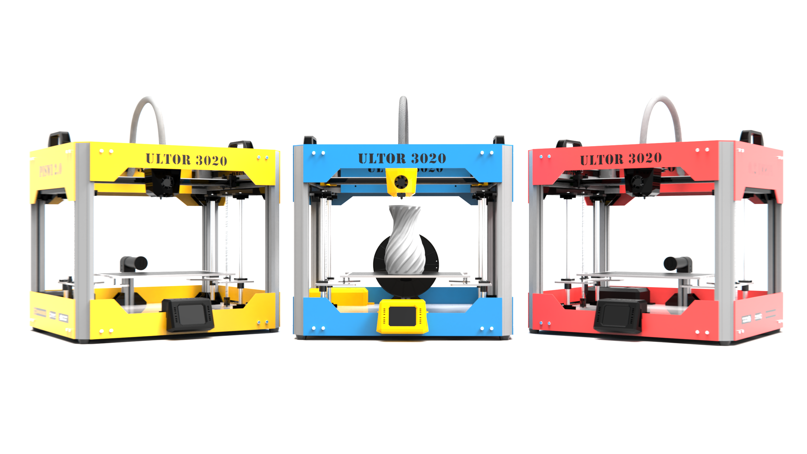
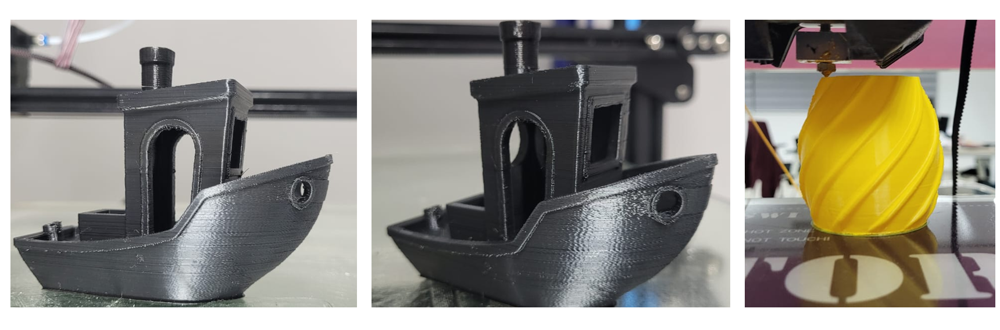
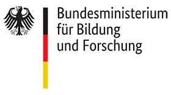
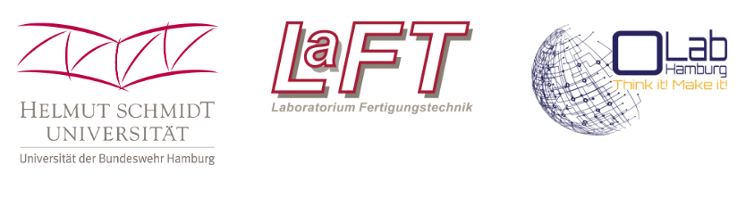
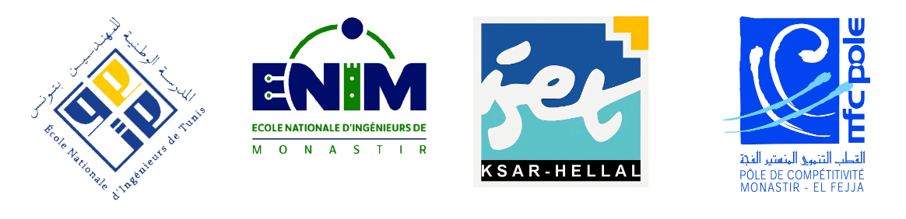

<h1 style=align="center">ULTOR3020</h1>

3D printing Test 
--

Author
--

**ULTOR3020** 3D Printer has been designed and built by **[InMachines Ingrassia GmbH](https://www.inmachines.net/)** & **[Fab619 On-Demand-Fabrication](https://fab619.tn/)**.

 

Machine design:
- **[Kais ALILA](http://fabacademy.org/2020/labs/kamplintfort/students/kais-alila/)**

The machine is part of the second **[PISWI](https://madeintunisia.org/)** project for the open machine design and assembly workshop in Tunisia. 

Acknowledgements
--
The development of this machine has been funded by:
**[German Federal Ministry of Education and Research](https://www.bmbf.de/en/index.html)**

Funds implemented by:
- **[OpenLab Hamburg](https://openlab-hamburg.de/startpage/)**
- **[Helmut-Schmidt-Universität Universität der Bundeswehr](https://www.hsu-hh.de/en/)**
    Laboratorium Fertigungstechnik
    Holstenhofweg 85
    22043 Hamburg

In partnership with :

- **[MFCPOLE - the Pole of Competitiveness Monastir-El Fejja.](http://www.mfcpole.com.tn/Fr/accueil_46_7)**
- **[ENIM - The National School of Engineers of Monastir.](https://enim.rnu.tn/)**
- **[ENIT - The National School of Engineers of Tunis.](http://www.enit.rnu.tn/fr/diverses/news.php)**
- **[ISET KH - The Higher Institute of Technological Studies of Ksar Hellal.](https://isetkh.rnu.tn/)**

License
--

Hardware design, CAD and PCB files, BOM, settings and other technical or design files are released under the following license:

- CERN Open Hardware Licence Version 2 Weakly Reciprocal - **[CERN-OHL-W](LICENSE_CERN_OHL_W_V2.txt)**

Assembly manual, pictures, videos, presentations, description text and other type of media are released under the following license:

- Creative-Commons-Attribution-ShareAlike 4.0 International - **[CC BY-SA 4.0](LICENSE_CC_BY_SA_4.0.txt)**

Note
--
This documentation will be continuously improved as soon there are updates and/or improvements on the machine.

Disclaimer
--

This hardware/software is provided "as is", and you use the hardware/software at your own risk. Under no circumstances shall any author be liable for direct, indirect, special, incidental, or consequential damages resulting from the use, misuse, or inability to use this hardware/software, even if the authors have been advised of the possibility of such damages.